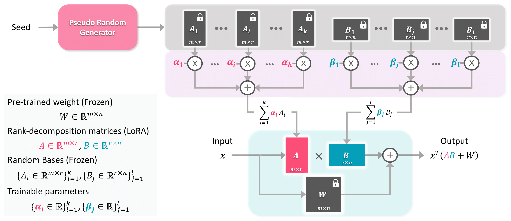

# NOLA: Networks as Linear Combination of Low Rank Random Basis

This Repository is an official implementation of NOLA.
Our code is based on [LoRA](https://github.com/microsoft/LoRA/tree/main). 

## Overview

NOLA is a novel approach for fine-tuning large models such as LLMs and Vision Transformers. Similar to LoRA, NOLA uses a low-rank decomposition of weight matrices for the fine-tuning step. However, instead of optmizing these matrices, we use a collection of such matrices with random initialization and learn just the mixture coefficients on the target task. This decouples the number of training parameters and the size of the weight matrices and provides a more fine-grained control on the number of training parameters. While LoRA is limited to rank one decomposition of the matrices to limit the training parameters, NOLA has no such limitations. Through experiments on both language and vision tasks, we show that NOLA outperforms LoRA at comparable parameters and achieves comparable performance with just half or one-third the parameters. The random basis matrices can be generated on the fly and can be shared across layers and tasks and thus provides training and inference memory efficiency. It can also be quantized better than LoRA and achieves comparable performance to full precision with 2-bit quantization of the NOLA parameters.



## Requirements

All our experiments use the PyTorch library. Instructions for PyTorch installation can be found [here](https://pytorch.org/). We primarily use GPT-2 for our experiments on natural language generation tasks.

## Dataset

We use E2ENLG, DART and WebNLG datasets for our experiments on natural language generation. 

## Getting Started 
Please install dependencies in a virtual environment: 
 
 ```
 pip install -r requirement.txt
 bash download_pretrained_checkpoints.sh
 bash create_datasets.sh
 cd ./eval
 bash download_evalscript.sh
 cd ..
 ```

## Finetuning with NOLA (float)

1. Finetune GPT-2 with NOLA: 
```
python -m torch.distributed.launch --nproc_per_node=1 src/gpt2_ft.py \
    --train_data ./data/e2e/train.jsonl \
    --valid_data ./data/e2e/valid.jsonl \
    --train_batch_size 8 \
    --grad_acc 1 \
    --valid_batch_size 4 \
    --seq_len 512 \
    --model_card gpt2.md \
    --init_checkpoint ./pretrained_checkpoints/gpt2-medium-pytorch_model.bin \
    --platform local \
    --clip 0.0 \
    --lr 0.1 \
    --weight_decay 0.0 \
    --correct_bias \
    --adam_beta2 0.999 \
    --scheduler linear \
    --warmup_step 500 \
    --max_epoch 5 \
    --save_interval 1000 \
    --nola_rank 8 \
    --nola_c 1.0 \
    --nola_qv \
    --label_smooth 0.1 \
    --work_dir ./trained_models/GPT2_M/e2e \
    --random_seed 110
```

2. Use beam search to generate outputs from the finetuned model:
```
python -m torch.distributed.launch --nproc_per_node=1 src/gpt2_beam.py \
    --data ./data/e2e/test.jsonl \
    --batch_size 1 \
    --seq_len 512 \
    --eval_len 64 \
    --model_card gpt2.md \
    --init_checkpoint ./trained_models/GPT2_M/e2e/model.26290.pt \
    --platform local \
    --nola_rank 8 \
    --nola_c 1.0 \
    --nola_qv \
    --beam 10 \
    --length_penalty 0.8 \
    --no_repeat_ngram_size 4 \
    --repetition_penalty 1.0 \
    --eos_token_id 628 \
    --work_dir ./trained_models/GPT2_M/e2e \
    --output_file predict.26290.b10p08r4.jsonl
```

3. Decode outputs:
```
python src/gpt2_decode.py \
    --vocab ./vocab \
    --sample_file ./trained_models/GPT2_M/e2e/predict.26290.b10p08r4.jsonl \
    --input_file ./data/e2e/test_formatted.jsonl \
    --output_ref_file e2e_ref.txt \
    --output_pred_file e2e_pred.txt
```

4. Run evaluation on E2E test set

```
python eval/e2e/measure_scores.py e2e_ref.txt e2e_pred.txt -p
```

# Finetuning with NOLA (Quantized)

1. Finetune GPT-2 with NOLA (add `--qnola` flag and number of bits per parameter `--qbits 3`): 
```
python -m torch.distributed.launch --nproc_per_node=1 src/gpt2_ft.py \
    --train_data ./data/e2e/train.jsonl \
    --valid_data ./data/e2e/valid.jsonl \
    --train_batch_size 8 \
    --grad_acc 1 \
    --valid_batch_size 4 \
    --seq_len 512 \
    --model_card gpt2.md \
    --init_checkpoint ./pretrained_checkpoints/gpt2-medium-pytorch_model.bin \
    --platform local \
    --clip 0.0 \
    --lr 0.1 \
    --weight_decay 0.0 \
    --correct_bias \
    --adam_beta2 0.999 \
    --scheduler linear \
    --warmup_step 500 \
    --max_epoch 5 \
    --save_interval 1000 \
    --nola_rank 8 \
    --nola_c 1.0 \
    --qnola \
    --qbits 3 \
    --nola_qv \
    --label_smooth 0.1 \
    --work_dir ./trained_models/GPT2_M/e2e \
    --random_seed 110
```

2. Use beam search to generate outputs from the finetuned model:
```
python -m torch.distributed.launch --nproc_per_node=1 src/gpt2_beam.py \
    --data ./data/e2e/test.jsonl \
    --batch_size 1 \
    --seq_len 512 \
    --eval_len 64 \
    --model_card gpt2.md \
    --init_checkpoint ./trained_models/GPT2_M/e2e/model.26290.pt \
    --platform local \
    --nola_rank 8 \
    --nola_c 1.0 \
    --nola_qv \
    --qnola \
    --qbits 3 \
    --beam 10 \
    --length_penalty 0.8 \
    --no_repeat_ngram_size 4 \
    --repetition_penalty 1.0 \
    --eos_token_id 628 \
    --work_dir ./trained_models/GPT2_M/e2e \
    --output_file predict.26290.b10p08r4.jsonl
```

3. Decode outputs:
```
python src/gpt2_decode.py \
    --vocab ./vocab \
    --sample_file ./trained_models/GPT2_M/e2e/predict.26290.b10p08r4.jsonl \
    --input_file ./data/e2e/test_formatted.jsonl \
    --output_ref_file e2e_ref.txt \
    --output_pred_file e2e_pred.txt
```

4. Run evaluation on E2E test set

```
python eval/e2e/measure_scores.py e2e_ref.txt e2e_pred.txt -p
```


## Citation

If you make use of the code, please cite the following work:
```
@inproceedings{koohpayegani2023nola,
 author = { Koohpayegani, Soroush Abbasi and Navaneet, K L and Nooralinejad, Parsa and Kolouri, Soheil and Pirsiavash, Hamed},
 title = {NOLA: Networks as Linear Combination of Low Rank Random Basis},
 year = {2023}
}
```

## License

This project is under the MIT license.
